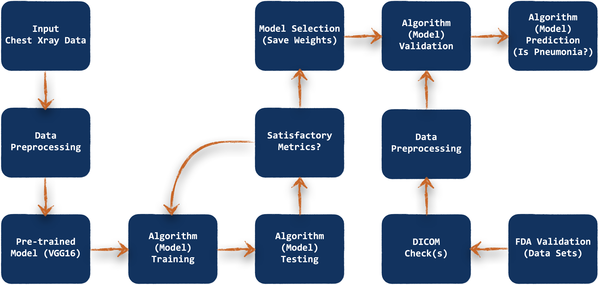

# FDA  Submission

[flowchart]: misc/Flowchart.png "Algorithm Flowchart"

**Your Name:** Mustafa Youldash

**Name of your Device:** ChestXrayAnalyzer

## Algorithm Description 

### 1. General Information

**Intended Use Statement:** An algorithm intended for use by radiologists, assisting them with Pneumonia detection and identification, using two-dimensional (2D) chest X-ray scans as the data source.

**Indications for Use:** The algorithm may be deployed in a clinical setting that can analyze patient data to assist them in detecting the existence of Pneumonia by relying on their medical X-ray scans as input to the algorithm (or model if you may will). Patient’s medical history may well indicate Pneumonia or not. Patents are expected to be aged between their first year of age till 95 yrs. A patient can be either male or female. The X-ray scans (or images) are expected to be captured (scanned) in either a PA-, or an AP-viewing position (for clarity, PA stands for Posterior-Anterior, and AP stands for Anterior-Posterior).

**Device Limitations:** For the algorithm to run effectively, it must be installed and configured on a workstation (or computer) equipped with a capable **[NVIDIA Graphics Processing Unit (GPU)](https://www.nvidia.com/en-us/geforce/graphics-cards/30-series/rtx-3080-3080ti/)** that is [CUDA-capable](https://developer.nvidia.com/cuda-gpus/). More importantly, the GPU (or GPUs if the computer is equipped with more than one) must have enough VRAM (i.e., GPU memory) to handle the X-ray data properly. The algorithm, once trained and validated, can then be deployed on an application setting that can be either a desktop application or Web-based. There are no specific requirements for running the algorithm on the Operating System of choice – if the system can support CUDA. 

**Clinical Impact of Performance:**

### 2. Algorithm Design and Function

	

**DICOM Checking Steps:**

**Preprocessing Steps:**

**CNN Architecture:**

### 3. Algorithm Training

**Parameters:**
* Types of augmentation used during training
* Batch size
* Optimizer learning rate
* Layers of pre-existing architecture that were frozen
* Layers of pre-existing architecture that were fine-tuned
* Layers added to pre-existing architecture

<< Insert algorithm training performance visualization >> 

<< Insert P-R curve >>

**Final Threshold and Explanation:**

### 4. Databases
 (For the below, include visualizations as they are useful and relevant)

**Description of Training Dataset:** 

**Description of Validation Dataset:** 

### 5. Ground Truth

### 6. FDA Validation Plan

**Patient Population Description for FDA Validation Dataset:**

**Ground Truth Acquisition Methodology:**

**Algorithm Performance Standard:**
