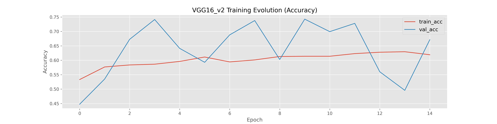
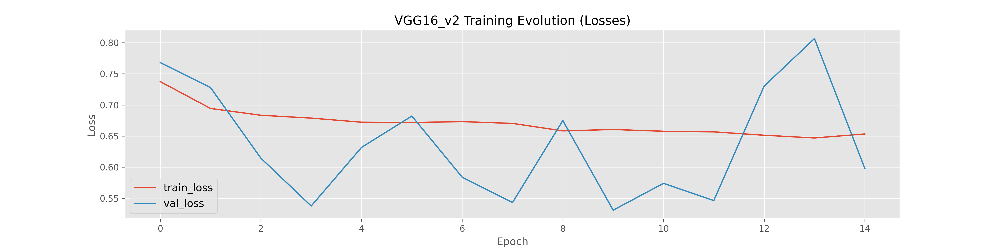
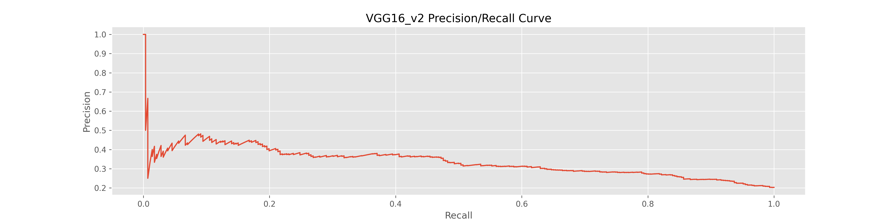
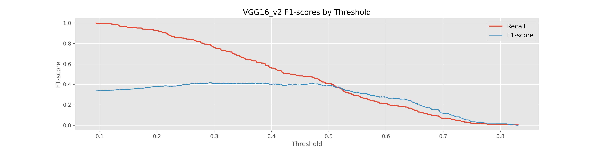
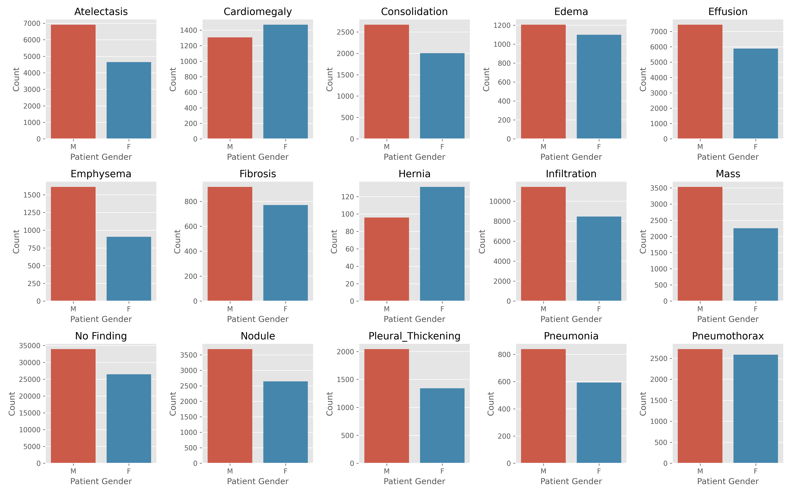

# FDA Submission

[flowchart]: misc/Flowchart.png "Algorithm Flowchart"

**Your Name:** Mustafa Youldash

**Name of your Device:** ChestXrayAnalyzer

## Algorithm Description 

### 1. General Information

#### Intended Use Statement

An algorithm intended for use by radiologists, assisting them with Pneumonia detection and identification, using two-dimensional (2D) chest X-ray scans as the data source.

#### Indications for Use

The algorithm may be deployed in a clinical setting that can analyze patient data to assist them in detecting the existence of Pneumonia by relying on their medical X-ray scans as input to the algorithm (or model if you may will). Patient’s medical history may well indicate Pneumonia or not. Patents are expected to be aged between their first year of age till 95 yrs. A patient can be either male or female. The X-ray scans (or images) are expected to be captured (scanned) in either a PA-, or an AP-viewing position (for clarity, PA stands for Posterior-Anterior, and AP stands for Anterior-Posterior).

#### Device Limitations

For the algorithm to run effectively, it must be installed and configured on a workstation (or computer) equipped with a capable **[NVIDIA Graphics Processing Unit (GPU)](https://www.nvidia.com/en-us/geforce/graphics-cards/30-series/rtx-3080-3080ti/)** that is **[CUDA-capable](https://developer.nvidia.com/cuda-gpus/)**. More importantly, the GPU (or GPUs if the computer is equipped with more than one) must have enough VRAM (i.e., GPU memory) to handle the X-ray data properly. The algorithm, once trained and validated, can then be deployed on an application setting that can be either a desktop application or Web-based. There are no specific requirements for running the algorithm on the Operating System of choice – if the system can support CUDA. 

#### Clinical Impact of Performance

The goal here is to assist radiologists with their review of medical X-rays scans for indications of Pneumonia in them. A radiologist is expected to review all X-ray data and validate the validate the outcomes (using the device). In a situation where the device * inaccurately* claims the presents of Pneumonia in an image (in other words, it results in predicting a False Positive (FP) case from an image), the patient can then be directed for a sputum culture (or test) at a medica facility, and then the diagnoses/results from such a test can be further used to verify and validate the prediction. In the case of a False Negative (FN) however, a patient is most likely to be impacted adversely. To prevent this, a radiologist is advised to report to the clinician (in charge) to revise the outcomes of the prediction (including the original X-ray scan(s)) and proceed to performing a sputum culture. Hence, the radiologist’s review of the results is crucial.

### 2. Algorithm Design and Function

<div align="center">
	
</div>

#### DICOM Checking Steps

The implementation checks the **DICOM** file *headers* looking for certain parameters like the following:
```
BodyPartExamined == 'CHEST'
Modality == 'DX'
PatientPosition is in a 'PA' or 'AP' viewing position
```
In other words, the checks involve:

- Analyzing the DICOM file, ensuring that the body part examined is a valid chest X-ray.
- Analyzing the DICOM file again to ensuring that the Imaging Modality is “DX.”
- Analyzing the DICOM file again to ensure that the Viewing Positions are valid AP and PA positions.

If *any* of the three categories did not match the requirements, a warning message will then be presented telling the user that the image did not meet the expected criteria.

#### Preprocessing Steps

If a DICOM file passes the initial DICOM file header checks, the DICOM pixel array will then be edited. A copy of the DICOM pixel array data will then be **normalized**, and **resized** to fit a `224 x 224` pixel ratio (or resolution).

In short, DICOM pixel array modifications will include:

- Image standardization (a.k.a. normalization), and
- Image resizing.

#### CNN Architecture

##### In a nutshell

In the process of designing the algorithm, a **Sequential** model was built by fine-tuning an existing **VGG16** pertained model (obtained via download) with predefined **ImageNet** weights. So, the new model included the original VGG16 model layers and incorporated them in its initial design. The VGG16 internal layers were then *frozen* to avoid training and end up accidentally adjusting the original VGG16 weights. The output from this new model was then flattened, and new layers were then added (to the end of the model).

The following is a summary (detailed description) of the original VGG16 model used in the design of the final model:

```
Model: "VGG16"
_________________________________________________________________
 Layer (type)                Output Shape              Param #   
=================================================================
 input_1 (InputLayer)        [(None, 224, 224, 3)]     0         
 block1_conv1 (Conv2D)       (None, 224, 224, 64)      1792      
 block1_conv2 (Conv2D)       (None, 224, 224, 64)      36928     
 block1_pool (MaxPooling2D)  (None, 112, 112, 64)      0         
 block2_conv1 (Conv2D)       (None, 112, 112, 128)     73856     
 block2_conv2 (Conv2D)       (None, 112, 112, 128)     147584    
 block2_pool (MaxPooling2D)  (None, 56, 56, 128)       0         
 block3_conv1 (Conv2D)       (None, 56, 56, 256)       295168    
 block3_conv2 (Conv2D)       (None, 56, 56, 256)       590080    
 block3_conv3 (Conv2D)       (None, 56, 56, 256)       590080    
 block3_pool (MaxPooling2D)  (None, 28, 28, 256)       0         
 block4_conv1 (Conv2D)       (None, 28, 28, 512)       1180160   
 block4_conv2 (Conv2D)       (None, 28, 28, 512)       2359808   
 block4_conv3 (Conv2D)       (None, 28, 28, 512)       2359808   
 block4_pool (MaxPooling2D)  (None, 14, 14, 512)       0         
 block5_conv1 (Conv2D)       (None, 14, 14, 512)       2359808   
 block5_conv2 (Conv2D)       (None, 14, 14, 512)       2359808   
 block5_conv3 (Conv2D)       (None, 14, 14, 512)       2359808   
 block5_pool (MaxPooling2D)  (None, 7, 7, 512)         0                                                            
=================================================================
```

The following is a summary of the layers added to the final model, which we will refer to from now on as `VGG16_v2`:

```
Model: "VGG16_v2"
_________________________________________________________________
 Layer (type)                Output Shape              Param #   
=================================================================
 model_2 (Functional)        (None, 7, 7, 512)         14714688  
 flatten_1 (Flatten)         (None, 25088)             0         
 dropout (Dropout)           (None, 25088)             0         
 dense_1 (Dense)             (None, 1024)              25691136  
 dense_2 (Dense)             (None, 1)                 1025      
=================================================================
```

### 3. Algorithm Training

#### Parameters:

##### Types of augmentation used during training:

Keras's `ImageDataGenerator` Python package was used to define the following parameters:

- An image horizontal flip with a `10%` shift range in width, height, shear and zoom.
- An image rotation range set to `20` degrees.

##### Batch size:

A `BATCH_SIZE` hyperparameter was initially set to values greater than `16`, but due to GPU VRAM limitations in the training process (as explained in the training report/notebook) it was adjusted to `8`.

##### Optimizer learning rate:

A `LR_RATE` hyperparameter was set to `1e-5` (i.e., `0.00001`).

##### Layers of pre-existing architecture that were frozen:

All output layers were, except the layer named `block5_pool`.

##### Layers of pre-existing architecture that were fine-tuned:

No layers from `VGG16` were fine-tuned at this stage.

##### Layers added to pre-existing architecture:

One dropout layer to `VGG16_v2` (i.e., by specifying `fc_list=[1024]` in the code), and one Fully-connected (FC) layer into the model architecture.

##### Algorithm training performance visualization 

<div align="center">
	
</div>

<div align="center">
	
</div>

##### P-R curve

<div align="center">
	
</div>

#### Final Threshold and Explanation:

Final (maximum) threshold reached was `0.2934`. This figure was obtained when then F1-score waz maxed out at a value of `0.4166`. It corresponded to a `28.25%` (i.e., `0.2825`) Precision value and a `79.02%` (i.e., `0.7902`) Recall value.

<div align="center">
	
</div>

### 4. Databases

#### Description of Training Dataset:

The [NIH Chest X-ray](https://www.kaggle.com/nih-chest-xrays/data) training data set contains `112,120` X-ray images with disease labels from `30,805` unique patients – having `15` *unique* disease labels/names within. The training data set is balanced for Pneumonia cases and contains `2290` images sampled from the complete image set.

By using patient demographics such as the **age** and **gender**, we can get a better picture of the general population and distribution. The following figure can give a better picture of how the unique cases are identified by gender:

<div align="center">
	
</div>

#### Description of Validation Dataset:

The validation data set is an *imbalanced* set containing `20%` cases positive for Pneumonia, and a total of `1430` images sampled from the `112,120` chest X-ray data – having `14` *unique* disease labels/names from `30,805` unique patients.

By saying imbalanced we also emphasize that the data set (for effectively training and validating the algorithm) was split into `80%` training data, and the remaining `20%` for validation purposes.By saying imbalanced we also emphasize that the data set (for effectively training and validating the algorithm) was split into `80%` training data, and the remaining `20%` for validation purposes.

### 5. Ground Truth

It appears that the data used in this work was curated by the [NIH](https://www.kaggle.com/nih-chest-xrays/data). Furthermore, the disease labels for each image (or scan if you may will) was created using Natural Language Processing (or NLP) techniques for processing the associated (contextual) radiological reports. It is reported that the *estimated* accuracy level of the NLP approach was believed to be over `90%`.
Because the original radiology reports were not publicly available for general review, we believe this sets a limitation on the NLP accuracy and as such, we cannot rectify the labelling. If such crucial pieces of information were made available for anyone to review, then the labelling accuracy is expected to be reasonably higher that originally reported.

### 6. FDA Validation Plan

#### Patient Population Description for FDA Validation Dataset:

The FDA validation data was acquired from `6` patients, all of which are males aging: `58yrs` for one patient, `71yrs` for another, and the remaining 4 aged at `81yrs` old.

To provide a more-meaningful validation, especially when it comes to the data in question, we believe the patient population *should* be consist of both genders – in a ratio that divides the population by approximately `1:1`. 

#### Ground Truth Acquisition Methodology:

The goal (or purpose) of this device design, as mentioned earlier, is to assist the radiologist with his/her routinely workflow onsite. So, the ideal situation would be for the radiologist to review the X-ray scans while having the relevant medial histories (and diagnoses) handy with them – especially any lab reports that could be acquired. For radiologists to *bypass* any inaccuracies introduced by the NLP approaches reported, they should be able to acquire digital copies for them to effectively identify and mark the diseases visible to them in the X-rays. This step can be considered a *checksum* process whereby a list of potentially common diseases can be thoroughly, and easily identified in a timely fashion.

#### Algorithm Performance Standard:

Based on the work published by P. Rajpurkarpar, et. al. (2017), the performance standard is the **F1-scores** metric, which is used in comparing radiologists and various novel algorithms in the domain. The F1-score servs as a *harmonic average* of the precision and recall of the models published in the literature.

The device developed by Rajpurkarpar, et. al. (dubbed **CheXNet**) seemed to have achieved an F1-score of `0.435`, while radiologists seemed to have averaged at a score of `0.387`. The F1-score reported for `VGG16_v2` was ` 0.4166` for its maximum threshold achieved, which is slightly lower than CheXNet’s score. Nevertheless, these scores can serve as benchmarks for future devices and innovations, and enhancements (on any existing works like the device presented herein) to come.
